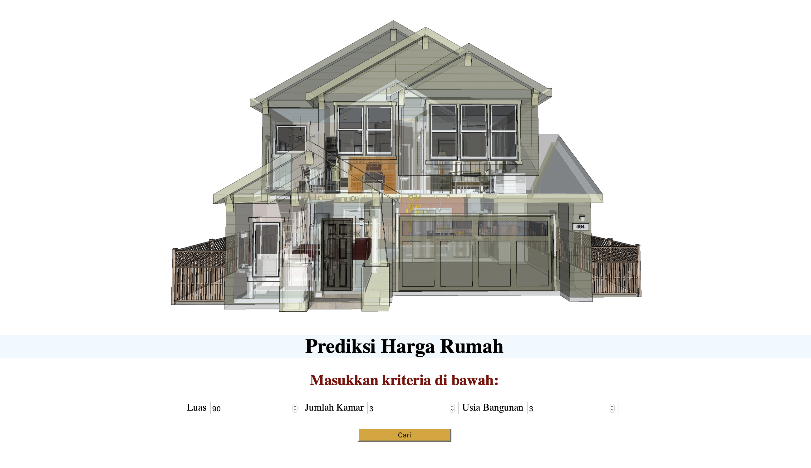
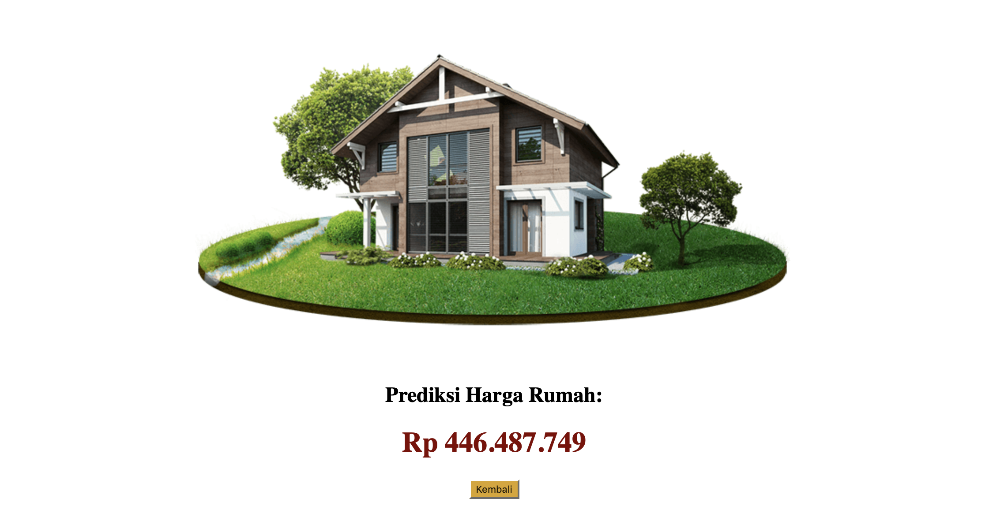

# DUMMY APP OF HOUSE PRICE PREDICTION USING LINEAR REGRESSION METHOD

#### This case uses dummy data and only for model test purpose
#

This app is consist of Flask coded by python and also  Linear Regression machine learning model file is included.

At the home page you are supposed to give input on 3 criterias: Luas, Jumlah Kamar, Usia Bangunan

Then, it will predict the best price of house based on your input criteria. This calculations are done by the Linear Regression method.

#
#### About Me: Suryo Tri Atmojo
#### Reach me out: _atmojo.suryo@gmail.com_

[GitHub](https://github.com/suryotriatmojo)
|
[Instagram](https://www.instagram.com/suryotriatmojo/)
|
[Facebook](https://www.facebook.com/suryo.t.atmojo)
|
[LinkedIn](https://www.linkedin.com/in/suryo-tri-atmojo-3ab69a85/)
|
[Twitter](https://twitter.com/suryota)